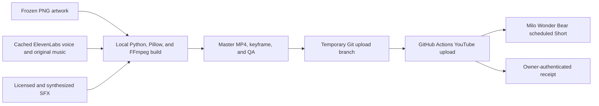

# Milo Smiling Critters Hard Edition

This is the production and delivery record for the Milo Wonder Bear Short `Can You Guess These 6 Smiling Critters? Hard Edition`.

The video was rendered locally. GitHub did not generate the artwork, narration, music, motion, or final edit; it provided the authenticated YouTube upload and verification lane.



## What shipped

| Item | Value |
| --- | --- |
| YouTube video | [`qJ-vm83JXj4`](https://youtu.be/qJ-vm83JXj4) |
| Channel | Milo Wonder Bear (`UCL0PybSo7k08IoLqtn4MIbg`) |
| Master filename | `milo-guess-these-smiling-critters-v1.mp4` |
| SHA-256 | `6462D9E8743909F4EDA9D1F4DB547AD155B7AA97785D4F58E83066F9D59FB1AA` |
| Size | 12,575,658 bytes |
| Format | 1080×1920 H.264, 30 fps; 48 kHz mono AAC |
| Duration | 42.533333 seconds |
| Loudness | -14.28 LUFS-I, -0.99 dBTP |

The local deliverable set also includes a full-resolution Shorts keyframe, an upload-copy text file, QA evidence, and a machine-readable YouTube receipt. Those production files are intentionally not stored on `main` in this repository.

## Creative specification

The six rounds are CatNap, DogDay, CraftyCorn, Bubba Bubbaphant, PickyPiggy, and KickinChicken. Their difficulty labels are Easy, Easy, Tricky, Hard, Expert, and Impossible.

The final format has:

- a full-color two-second opener;
- a 12-frame/0.40-second dissolve into CatNap's clue;
- a distinct full-screen moonlit playroom background;
- solid near-black mystery silhouettes over one neutral grayscale question treatment;
- no spoiler colors before reveals;
- plain clue text and bare countdown numerals with no boxes, rings, borders, or outlines;
- no Milo corner mark and no midpoint card;
- one continuous cosine-eased 0–6% zoom across each clue and countdown, rendered at 2160×3840 and downsampled to 1080×1920;
- no shake or pulse;
- two-frame flashes and name-only full-color reveals;
- a 0.45-second fakeout on the final round; and
- a 4.10-second score screen with a victory sting and cheer.

The hook says, “Can you guess these 6 Smiling Critters?” The wording uses “these 6” because the core franchise roster has eight characters.

## Local source of truth

The production workspace itself is not a Git repository. Its important relative paths are:

```text
work/build_smiling_critters_quiz.py
work/smiling-critters-v13/assets/
work/smiling-critters-v13/audio/
work/smiling-critters-v13/timeline.json
work/smiling-critters-v13/stages/
work/smiling-critters-v13/motion/
work/smiling-critters-v13/qa/
outputs/smiling-critters/
```

`build_smiling_critters_quiz.py` is the one-command production entry point. Its `main()` chain is:

```text
generate_audio
→ prepare_assets
→ validate_cutouts
→ build_hook_keyframe
→ build_timeline
→ render_stages
→ render_smooth_motion_clips
→ concatenate and mix
→ encode
→ QA
→ write upload copy
```

The historical environment was Windows, Python 3.8.10, Pillow 10.4.0, and FFmpeg/ffprobe 8.1.2. The renderer uses Windows Arial fonts and requires FFmpeg on `PATH`.

### Visual inputs

The moonlit playroom is a retained ImageGen PNG. The six characters are retained stylized fan-art PNGs with genuine alpha from an earlier editable Critters project. The exact ImageGen prompts were not saved, so these frozen PNGs—not prompt regeneration—are the reproducible visual inputs.

The builder cleans the authored alpha and gives each cutout 72 transparent pixels of padding. This prevents filtering or mask blur from exposing a hard rectangular sprite edge.

### Narration and music

Narration uses ElevenLabs `Spark V3 - Kids Channel`, voice ID `gQJuGG6e5PCpQOXcNnJC`, model `eleven_v3`, text-to-dialogue WAV at 48 kHz, and stability `1.0`. Exact line text and take durations are stored in the local `voice-manifest.json`.

Music is an original ElevenLabs `music_v2` instrumental, song ID `8YPJAhn3G3nDpwoLPBWt`. Its saved prompt requests a kid-friendly creepy Playcare lullaby with six anticipation rises and explicitly excludes vocals, screams, jump scares, copyrighted melodies, and artist imitation.

The mix uses original synthesized character cues plus Mixkit Free License reveal/score/cheer effects and one CC0 gasp. No Poppy Playtime, Smiling Critters, Rainbow Friends, Roblox, or APM game audio was extracted.

Cached audio is required for a byte-stable recreation. ElevenLabs V3 is nondeterministic, and deleting a cached take may consume credits and produce a different performance.

## Local QA

The final build passed:

- 1080×1920 geometry and constant 30 fps;
- H.264/AAC decode with no errors;
- 48 kHz audio with no unintended silence;
- -14.28 LUFS-I and -0.99 dBTP;
- at least 72 px of transparent padding on all six cutouts;
- zero measured color leakage in all exported guess frames;
- zero RGB channel difference in the generated silhouettes;
- visual checks for the opener/dissolve, crop safety, alpha edges, text safety, smooth zoom, and reveal sync.

The floating timeline ends at 42.52 seconds. Frame rounding produces the correct encoded duration of 42.533333 seconds.

## GitHub delivery record

The exact upload used a one-off public branch:

| Field | Value |
| --- | --- |
| Branch | `agent/milo-smiling-critters-upload-20260814` |
| Commit | [`2fe84010590bbf14fa3aff963cd591f06ae3f9e5`](https://github.com/Blovely133/vault-pulse-dashboard/commit/2fe84010590bbf14fa3aff963cd591f06ae3f9e5) |
| Staged path | `uploads/milo/milo-guess-these-smiling-critters-v1.mp4` |
| Preflight run | [`31809931661`](https://github.com/Blovely133/vault-pulse-dashboard/actions/runs/31809931661) |
| Upload run | [`31810182047`](https://github.com/Blovely133/vault-pulse-dashboard/actions/runs/31810182047) |

That branch version of `.github/workflows/yt-upload.yml` added three safeguards around the existing resumable uploader:

1. Assert the OAuth channel identity before creating a video.
2. Write the owner-selected audience and altered-content disclosure values explicitly.
3. Poll YouTube processing and print a detailed owner-authenticated readback.

The workflow received base64-encoded UTF-8 title and description fields, plus the channel, branch-local file, tags, category, and RFC3339 publish time. The upload was created as private with a future `publishAt`; the keyframe/thumbnail was left untouched for the owner.

Historical upload settings:

| Field | Value |
| --- | --- |
| Title | `Can You Guess These 6 Smiling Critters? Hard Edition` |
| Category | `24` — Entertainment |
| Scheduled time | `2026-08-14T15:26:49Z` / 10:26:49 AM Central |
| Made for kids | No |
| Altered/synthetic-content disclosure | No |
| Thumbnail set by workflow | No |

“Altered/synthetic-content disclosure: No” records the owner's platform disclosure choice for this stylized fictional quiz. It does not mean AI tools were absent: ImageGen and ElevenLabs were part of production.

The upload log returned all three required markers:

```text
IDENTITY_OK UCL0PybSo7k08IoLqtn4MIbg "Milo Wonder Bear"
YTU_OK qJ-vm83JXj4
YTU_VERIFY { ... }
```

The final readback reported the correct channel and title, private scheduled state, exact `publishAt`, both kids fields false, altered-content disclosure false, upload status `processed`, processing status `succeeded`, and no processing failure reason.

## Important cautions

- The historical schedule is in the past and must never be reused.
- Re-running the upload workflow creates a duplicate video. If a run fails after `YTU_OK`, recover and inspect that video ID instead of retrying.
- A green GitHub Action conclusion is not sufficient by itself; inspect `YTU_VERIFY` for identity, metadata, and processing success.
- The historical workflow log reports a missing `containsSyntheticMedia` field as false. Treat it as the workflow-reported and owner-selected setting, not proof that no AI was used.
- The complete builder, frozen inputs, and QA bundle remain local. GitHub was the delivery lane, not the creative source archive.
- The temporary upload branch contains a 12.6 MB MP4 and should not be merged into `main`. Future uploads should use private object storage or another authenticated short-lived transfer instead of public Git history.

See [YouTube upload runbook](../operations/youtube-upload.md) for the repeatable delivery procedure.
